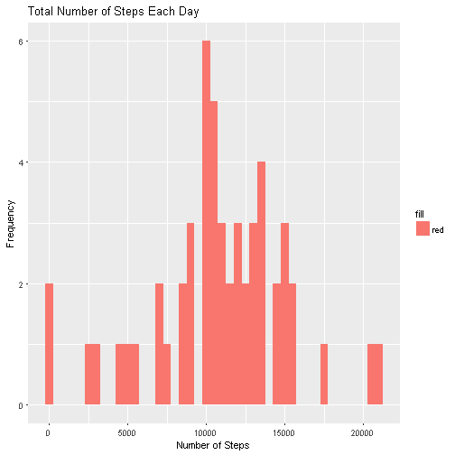
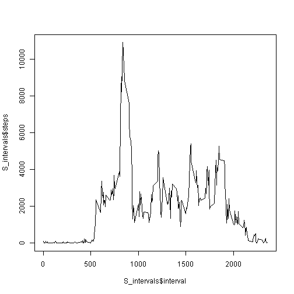
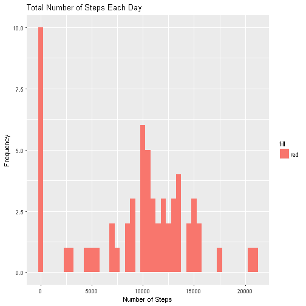
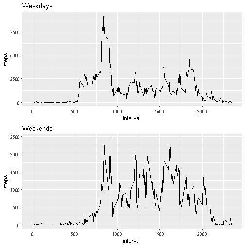

# Libraries

```r
library(lubridate) #For date conversion
library(ggplot2) #For Plotting
library(gridExtra) #For qplot() -> grid.arrange()
```

# Load the Data

```r
S <- read.csv("activity.csv") #Loads data into data frame
S$date <- ymd(S$date) #Convert 'date' column from factor to date
class(S$date) #Check class of S$date
```

```
## [1] "Date"
```

```r
S1 <- na.omit(S) #Remove all NA values
head(S1) #Print out S1
```

```
##     steps       date interval
## 289     0 2012-10-02        0
## 290     0 2012-10-02        5
## 291     0 2012-10-02       10
## 292     0 2012-10-02       15
## 293     0 2012-10-02       20
## 294     0 2012-10-02       25
```

# Make Histogram of Daily Data

```r
S_sum <- aggregate(steps~date, S1, sum) #Total Steps taken per day
head(S_sum)
```

```
##         date steps
## 1 2012-10-02   126
## 2 2012-10-03 11352
## 3 2012-10-04 12116
## 4 2012-10-05 13294
## 5 2012-10-06 15420
## 6 2012-10-07 11015
```

```r
#Histogram of total steps taken each day
qplot(steps, data = S_sum , geom = "histogram", binwidth = 500, fill = "red") + 
    labs(title = "Total Number of Steps Each Day", x = "Number of Steps", y = "Frequency")
```



## Compute Mean and Median

```r
mean_daily <- mean(S_sum$steps) #Mean of total number of steps
print(mean_daily)
```

```
## [1] 10766.19
```

```r
median_daily <- median(S_sum$steps) #Mdian of total number of steps
print(median_daily)
```

```
## [1] 10765
```

#Make Time-Series Plot Based on Intervals

```r
S_intervals <- aggregate(steps~interval, S1, sum) #Sum up values at each interval
head(S_intervals)
```

```
##   interval steps
## 1        0    91
## 2        5    18
## 3       10     7
## 4       15     8
## 5       20     4
## 6       25   111
```

```r
plot(S_intervals$interval, S_intervals$steps, type = "l") #Make time-series plot
```



```r
max_ind <- which.max(S_intervals$steps) #Find & print the max interval with the most steps
max_interval <- S$interval[max_ind]
print(max_interval)
```

```
## [1] 835
```

# Total Number of NA Values in Data Set

```r
print(sum(is.na(S)))
```

```
## [1] 2304
```

## Fill in NA Values with Zeros for 5 Minute Interval

```r
S_fill <- S
S_fill[is.na(S_fill)] <- 0 #We fill in the NA values with zero

head(S_fill)
```

```
##   steps       date interval
## 1     0 2012-10-01        0
## 2     0 2012-10-01        5
## 3     0 2012-10-01       10
## 4     0 2012-10-01       15
## 5     0 2012-10-01       20
## 6     0 2012-10-01       25
```

# Make Histogram of Daily Data for Filled Data

```r
S_sum_fill <- aggregate(steps~date, S_fill, sum) #Use aggregate to sum up values at each time --> daily
head(S_sum_fill)
```

```
##         date steps
## 1 2012-10-01     0
## 2 2012-10-02   126
## 3 2012-10-03 11352
## 4 2012-10-04 12116
## 5 2012-10-05 13294
## 6 2012-10-06 15420
```

```r
#Plot Histogram
qplot(steps, data = S_sum_fill , geom = "histogram", binwidth = 500, fill = "red")  + 
    labs(title = "Total Number of Steps Each Day", x = "Number of Steps", y = "Frequency")
```



## Compute Mean and Median for Filled Data

```r
mean_daily_fill <- mean(S_sum_fill$steps)  #Mean of total number of steps
print(mean_daily_fill)
```

```
## [1] 9354.23
```

```r
median_daily_fill <- median(S_sum_fill$steps)  #Median of total number of steps
print(median_daily_fill)
```

```
## [1] 10395
```

# Differences between Weekdays and Weekends?

```r
W <- wday(S_fill$date) #Use lubridate wday()
Is_Weekday <- ifelse(W %in% c(2,3,4,5,6), "Weekday", "Weekend") #2 - 6 are Mon - Fri

S_fill$Is_Weekday <- factor(Is_Weekday) #Create the factor variable for weekdays/weekends

head(S_fill)
```

```
##   steps       date interval Is_Weekday
## 1     0 2012-10-01        0    Weekday
## 2     0 2012-10-01        5    Weekday
## 3     0 2012-10-01       10    Weekday
## 4     0 2012-10-01       15    Weekday
## 5     0 2012-10-01       20    Weekday
## 6     0 2012-10-01       25    Weekday
```
## Panel Plot with Time Series Plot for Weekdays/Weekends

```r
split_wdays <- split(S_fill, S_fill$Is_Weekday)

wdays <- aggregate(steps~interval, split_wdays$Weekday, sum)
wknds <- aggregate(steps~interval, split_wdays$Weekend, sum)

q_wdays <- qplot(x = interval, y = steps, data = wdays, geom = "line") + ggtitle("Weekdays")
q_wknds <- qplot(x = interval, y = steps, data = wknds, geom = "line") + ggtitle("Weekends")

grid.arrange(q_wdays, q_wknds, ncol = 1)
```


